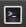
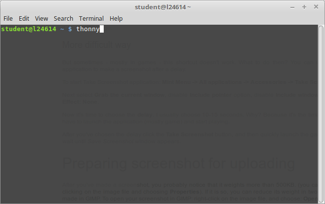
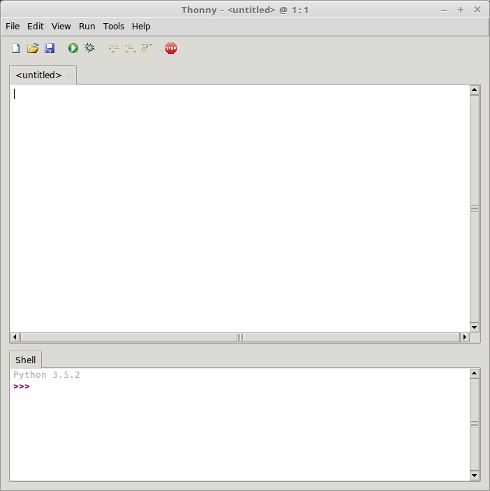
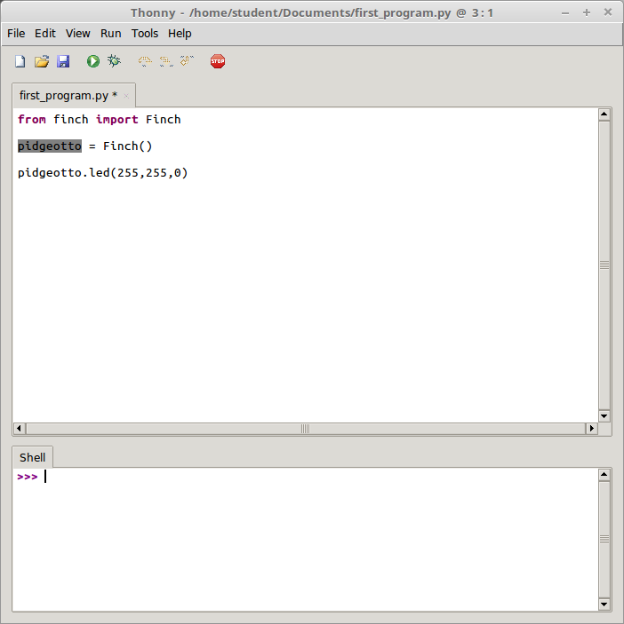

# Bird Whispering
## How to Stop Worrying and Love our Robot Overlords

Prof. John Bowers and Prof. Michael Stewart

James Madison University STEM Day 2018

### 1. Overview

In this activity you will learn the basics of the Python programming language by using it to program [Finch robots](https://www.finchrobot.com/). 

### 2. Getting Started

#### Download the Dev-Environment

Your __dev-environment__ is hacker speak for your "development environment", or the group of tools and apps you need to get started hacking your Finch robot. 

1. Download and install your dev-environment by right clicking on [this link](https://w3.cs.jmu.edu/cs101/unit12/Lab12.zip), selecting "Save Link As", and saving the file (Lab12.zip) to the Desktop (you should see the Desktop on the left-hand side of the save dialog). 
2. Minmimize this window, and you should see the Lab12.zip file on the desktop (raise your hand if you do not). Right click on the Lab12.zip file and select "Extract Here". 
3. We are now going to start your dev-environment using a powerful tool called the __Terminal__. We won't learn about the Terminal much today, but its one of the ways elite coders control their computers to get things done quickly (once you know the Terminal, it is much more powerful than the mouse). 

Start the Terminal by clicking this icon in the lower left-hand corner of your screen: 



This will start the Terminal app, which allows you to type out commands that directly control the computer. It is so powerful, in fact, that with a single command you can erase your entire computer! (_We won't be doing that today, of course..._.) We're going to use it to start our Finch programming app, which is called "thonny" (note the lower-case 't'). Start thonny by typing `thonny` into the Terminal and pressing the entire key. Something like this: 



Congrats! You've just cast your first terminal spell (er, command). You're now on your way to becoming a coder. You should now see something like this: 



Notice there is a toolbar of various buttons (new, open, save, then the run button, which looks like a green "play" button, and then a few others, like the debug button, which we won't use today). Next there is a large editor window (labeled &lt;untitled&gt; in the image above.) This is where you'll put code to load onto your Finch. Finallly, the bottom window shows the shell, which will allow you test bits of code before you actually put them in your main program. 

### 3. Put your lights on

OK! Let's start coding our birds. We're going to start by entering some python code into the main window of thonny. You'll notice that your finch's beak is cycling through colors. We're going to make the beak turn bright red (Rudolph the red-nosed robot? Sorry, dad joke.) Enter the following code exactly into the open `thonny` app window, so that it looks like the image below. 

Enter the following code into your thonny editor. 

```python 
from finch import Finch

pidgeotto = Finch() # create a new Finch() controller and name it pidgeotto

pidgeotto.led(255, 0, 0) # Light up the Finch's nose red. 
```

Ok, I'll do this once, but after this we're done with screenshots. Here's what it should look like. 



Now click on the "run" button, which looks like a big green play button. Since we haven't saved this program before, `thonny` will ask us to save it. In order for our program to work correctly with our robot avians, we need to save our file in the same folder as the finch.py file, which is another program called a "Library" which has additional code for talking to the robot. We've placed this in the /home/student/FinchPython120/ folder. Navigate to this folder and save your program as `first_program.py`. 

Ok, let's talk about each line of code in this program. The first is

```python 
from finch import Finch
```

It takes a lot of code for your computer to actually talk to the Finch. If we had to write all this code from scratch by ourselves, we would never be able to get anything done. Instead, people have already written a lot of the code for us, and we can _use_ their pre-existing code in our own program. This is called a code library, because it allows us to borrow code from other programmers in a similar way to borrowing a book from the library. That line says `from` the code library stored in the `finch.py` file, borrow the code for the base `Finch` program. Every one of our Finch programs will begin with this line.

The next line

```python
pidgeotto = Finch() # create a new Finch() controller and name it pidgeotto
```

does two things. First, it calls the `Finch()` program that we imported from the `finch.py` library on the first line. Second, in order for us to actually tell the `Finch` to do something, we need to give it a name. This is the point of the `pidgeotto =` part of the code. This __assigns__ the name `pidgeotto` to the newly created `Finch()`. This name, `pidgeotto`, is called a __variable__. Variables in a program allow us to store data under different names so that they can be used and referred to multiple times in the program, and not just once. 

Try changing this name to your own name and running the code again. 

Something like,

```python 
from finch import Finch

hermione = Finch() # create a new Finch() controller and name it pidgeotto

pidgeotto.led(255, 0, 0) # Light up the Finch's nose red. 
```

Oh No! When we run the code above, you'll notice we get an angry red text in the shell window called an __error__. Notice towards the bottom of this error, it says 

```
NameError: name 'pidgeotto' is not defined
```

This is because our Finch is now named `hermione`, but we are still trying to refer to it with the name `pidgeotto`. In order to make this work, we have to replace all references to `pidgeotto` with references to `hermione`. 

```python 
from finch import Finch

hermione = Finch() # create a new Finch() controller and name it hermione

hermione.led(255, 0, 0) # Light up the Finch's nose red. 
```

Also, note that assignments always place the name on the left. The following would __not__ work. 

```python
Finch() = hermione # This is backwards!!! New variable names go on the right of the '='
```

Notice also that we have a __comment__ on this line, which is English text following the hashtag symbol `#`. The purpose of this is to allow us add comments on what a line of code is doing so that we can more easily remember how the code worked later. It's always important to __document__ your code by adding comments. In the code below, we will often add comments to help explain what its doing. (If we did not proceed our explanations, written in english, with the `#`, then our program would have an error telling us that the english part is invalid python.)

Finally, the last line of our program, which now reads 

```python
hermione.led(255, 0, 0) # Light up the Finch's nose red. 
```

activates the <abbr title="Light-Emitting Diode, a kind of light">LED</abbr> lights inside the Finch's beak. The `.led(255,0,0)` following `hermione` on this line tells our program to run the `led` function with values of 255, 0, and 0 on the `hermione` Finch. 

#### Puzzles 

* Notice that three numbers are given to the led function. Try changing these numbers to figure out what they mean. Hint: you may want to try values between 0 and 255 for each. 
* Why are there three numbers instead of one? 
* What does each number do?
* Can you make the Finch's nose appear purple? 
* How about yellow?


### 4. Finchy Fireworks

Let's try making our Finch show its beak red, then blue, then red. Run the following code. 

```python 
from finch import Finch

hermione = Finch() # We have a little Finch, and her name's Hermione. 

hermione.led(255, 0, 0) # Turn hermy's beak red
hermione.led(0, 0, 255) # Turn hermy's beak blue
hermione.led(255, 0, 0) # Turn hermy's beak red
```

#### Run the code and see what happens.

What's going on? Where's our blue beak? 

Our program only has three main lines of code, turn beak red, turn beak blue, turn beak red. The problem is that lines of code like this execute so fast on a computer that the LEDs don't have time to change from red to blue before the line of code changing it back to red has already executed. What we would really like to do is turn the beak read, then wait a second, then turn the beak blue, then wait a second, then turn it back to red. 

Fortunately, python has a little library for making a program wait for some amount of time before going to the next line of code. This is called sleeping the program, and is made available in the `time` library. Let's `import` the code for the `sleep` command from the `time` library and add some sleeping to our program. 

```python
from finch import Finch
from time import sleep

hermione = Finch() # Name our Finch hermione

hermione.led(255,0,0) #red beak!
sleep(1.0) # sleep this program for 1 second
hermione.led(0,0,255) #blue beak!
sleep(1.0) # sleep this program for 1 second
hermione.led(255,0,0) #red beak!
```

Run the code to see what happens. We're also going to make use of the `sleep` command in the next section. 

### 5. Fly bird, fly!

Our Finch's don't have wings, but the do know how to fly on wheels. Run the following code. 

```python
from finch import Finch
from time import sleep

hermy = Finch() # Why did we change its name to hermy?

hermy.wheels(1.0, 1.0)
sleep(3.0)
hermy.halt()
```	

#### Puzzles

* Why does the code involve the `sleep` function?
* What do you think `hermy.halt()` does? 
* Why does the `wheels` command take two numbers and not just one?

#### Challenges

* Make the Finch back up instead of move forward. 
* Make the Finch move in a circle. 
* Make the Finch dance. 
* Make the Finch rave dance (both colors and motion!).
* Make your Finch move in a square (you might want to think about moving forwards some amount, then turning left, for instance). 

### 6. Singing Ability +1

The finch can sing. Try adding the following: 

```python
hermy.buzzer_with_delay(0.1,880)
hermy.buzzer_with_delay(0.2,440)
hermy.buzzer_with_delay(0.1,1200)
```

You can also activate the buzzer without delaying so that you can run other commands. Test the difference between the following two code snippets.

```python
hermy.halt()
hermy.buzzer(1,880)
hermy.led(255,0,0)
sleep(1.0)
hermy.halt()
```

and

```python
hermy.halt()
hermy.buzzer_with_delay(1,880)
hermy.led(255,0,0)
sleep(1.0)
hermy.halt()
```


### 7. Complex Actions (x5 multiplier)

Recall your solution to making your Finch move in a square. Your code may have looked something like

```python
from finch import Finch
from time import sleep

kermy = Finch() # What, now it's kermy? 

kermy.wheels(1,1) #move forward
sleep(1.0)
kermy.wheels(-1,1) #turn left
sleep(0.3)

kermy.wheels(1,1) #move forward
sleep(1.0)
kermy.wheels(-1,1) #turn left
sleep(0.3)

kermy.wheels(1,1) #move forward
sleep(1.0)
kermy.wheels(-1,1) #turn left
sleep(0.3)

kermy.wheels(1,1) #move forward
sleep(1.0)
kermy.wheels(-1,1) #turn left
sleep(0.3)
```

Note how much repetition there is. We can group a sequence of commands together in a single command by defining a function. To do this, we use the following __syntax__:

```python
from finch import Finch
from time import sleep

kermy = Finch() # What, now it's kermy? 

 # Define a function that moves the finch forward
 # and turns it left. 
def forwardAndLeft():
	kermy.wheels(1,1)
	sleep(1.0)
	kermy.wheels(-1,1)
	sleep(0.3)

 # Now run our forwardAndLeft() function four times. 
 
forwardAndLeft()
forwardAndLeft()
forwardAndLeft()
forwardAndLeft()

kermy.halt()
```

Notice that our custom function is defined by using the keyword `def` followed by the name we want to give our command, followed by the open and closed paranetheses and a colon `:`. Then the commands of our custom function are all grouped by spacing each line over by the same amount. The function ends, when we get to a line of code that is not spaced over. 

#### Challenges

* Try making some of your own functions and stringing them together to form more complex behavior. Can one function call another function? 

### 8. Repeat (Repeat (Repeat (Repeat (Repeat))))

Another useful construct in programming is the loop construct, which allows us to repeat an action multiple times. Try the following program. 

```python
from finch import Finch
from time import sleep

kermy = Finch() # What, now it's kermy? 

 # Define a function that moves the finch forward
 # and turns it left. 
def forwardAndLeft():
	kermy.wheels(1,1)
	sleep(1.0)
	kermy.wheels(-1,1)
	sleep(0.3)

 # Now run our forwardAndLeft() function four times. 
for i in range(8):
	forwardAndLeft()
```

#### Puzzles

* What does this code do? 
* What do you think the `for i in range(8):` means? 
* Why is `forwardAndLeft()` separated over by several spaces? 
